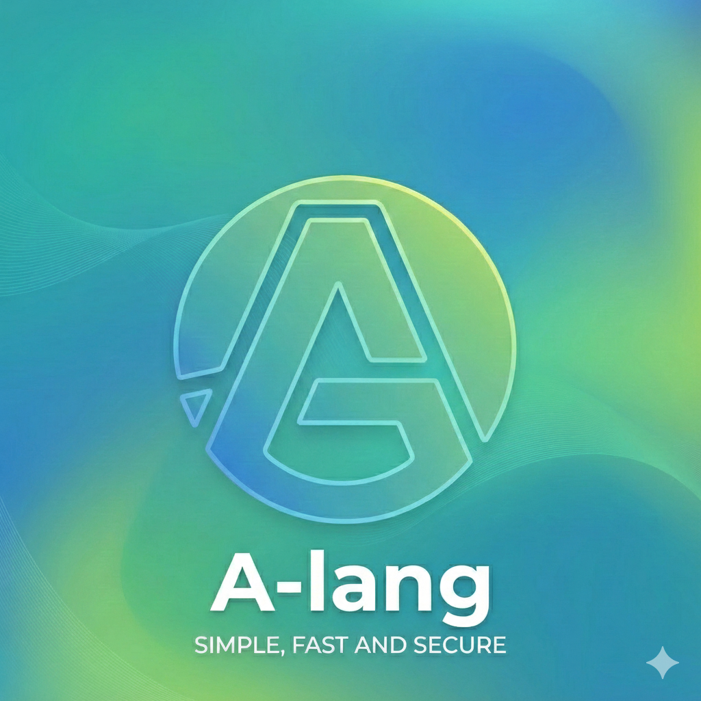

<div align="center">
  
</div>

<br/>

# 🚀 A-lang - The Time-Traveling Reactive Language

[](https://github.com/yourusername/a-lang/releases)
[](LICENSE)
[]()
[](https://www.rust-lang.org/)

**A-lang** is a revolutionary scripting language that brings together the best of modern language design with groundbreaking features like time-travel debugging and reactive variables. Built with Rust for performance and safety.

[🌐 Português](README.pt.md) | [📚 Documentation](DOCUMENTATION.md) | [🎯 Examples](examples/)

---

## ✨ Key Features

### 🌟 5 WOW Factors

#### ⏰ 1. Time-Travel Debugging
Debug like never before! Rewind execution, inspect historical states, and replay from any checkpoint.

```javascript
x = 10
snapshot("before")

x = x * 2
snapshot("after")

rewind("before")
print(x)  // 10 - Back in time!
```

**No external debugger needed!** Everything is built-in.

---

#### ⚡ 2. Reactive Variables
Automatic dependency tracking and updates. Changes propagate automatically.

```javascript
reactive count = 0

computed double = () => count * 2
effect () => print("Count: " + str(count))

count = 5  // Automatically prints "Count: 5"
print(double)  // 10
```

---

#### 🔌 3. FFI - Call C Functions
Direct access to C libraries. No wrappers needed.

```javascript
ffiLoadLibrary("libc", "/lib/x86_64-linux-gnu/libc.so.6")
ffiRegisterFunction("abs", "int", ["int"])

result = ffiCall("libc", "abs", [-42])
print(result)  // 42
```

**Use any C library** - system calls, hardware drivers, legacy code, or high-performance math.

---

#### 📥 4. User Input
Python-style input for interactive programs.

```javascript
name = input("What is your name? ")
print("Hello, " + name + "!")

age = int(input("Your age: "))
```

---

#### 🌐 5. Full-Stack Ready
Backend, networking, databases, and IoT - all built-in.

```javascript
// Express-like HTTP server
app = createExpressApp()
app.get("/", fn(req, res) {
    res.send("Hello, World!")
})
app.listen(3000)

// MySQL database
db = connectMySQL("localhost", "user", "pass", "mydb")
results = db.query("SELECT * FROM users")

// IoT hardware
gpioInit(17, "output")
gpioWrite(17, "high")
```

---

## 🚀 Quick Start

### Installation

#### Ubuntu/Debian
```bash
wget https://github.com/yourusername/a-lang/releases/download/v1.0-preview/alang_1.0-preview_amd64.deb
sudo dpkg -i alang_1.0-preview_amd64.deb
```

#### Linux (Portable)
```bash
wget https://github.com/yourusername/a-lang/releases/download/v1.0-preview/alang-1.0-preview-linux-x64.tar.gz
tar -xzf alang-1.0-preview-linux-x64.tar.gz
export PATH=$PATH:$(pwd)/alang-1.0-preview-linux-x64
```

#### macOS
```bash
# Coming soon via Homebrew
brew install a-lang
```

#### Windows
Download and run [A-lang-1.0-preview-Setup.exe](https://github.com/yourusername/a-lang/releases)

---

### Hello World

```javascript
print("Hello, World!")
```

Run it:
```bash
alang hello.al
```

Or use the REPL:
```bash
alang
> print("Hello, World!")
Hello, World!
```

---

## 💡 Examples

### Interactive Calculator
```javascript
num1 = float(input("First number: "))
num2 = float(input("Second number: "))

print("Sum: " + str(num1 + num2))
print("Product: " + str(num1 * num2))
```

### FFI - Call C Functions
```javascript
// Load math library
ffiLoadLibrary("libm", "/lib/x86_64-linux-gnu/libm.so.6")

// Square root
ffiRegisterFunction("sqrt", "double", ["double"])
print(ffiCall("libm", "sqrt", [16.0]))  // 4.0

// Power
ffiRegisterFunction("pow", "double", ["double", "double"])
print(ffiCall("libm", "pow", [2.0, 8.0]))  // 256.0
```

### Time-Travel Debugging
```javascript
total = 0
for (i in range(5)) {
    total += i
    snapshot("step_" + str(i))
}
print("Final: " + str(total))

// Go back and inspect
rewind("step_2")
print("At step 2, total was: " + str(total))
```

### Reactive Counter
```javascript
reactive counter = 0

computed doubled = () => counter * 2
computed squared = () => counter * counter

effect () => {
    print("Counter: " + str(counter))
    print("Doubled: " + str(doubled))
    print("Squared: " + str(squared))
}

counter = 5
// Automatically prints:
// Counter: 5
// Doubled: 10
// Squared: 25
```

### REST API
```javascript
app = createExpressApp()

app.get("/api/hello", fn(req, res) {
    res.json({"message": "Hello, World!"})
})

app.post("/api/echo", fn(req, res) {
    body = req.body
    res.json(body)
})

print("Server running on http://localhost:3000")
app.listen(3000)
```

---

## 📚 Language Features

### Modern JavaScript-like Syntax
```javascript
// Variables
name = "Alice"
age = 30
active = true

// Functions
fn greet(name) {
    return "Hello, " + name + "!"
}

// Arrow functions
double = (x) => x * 2
add = (a, b) => a + b

// Control flow
if (age >= 18) {
    print("Adult")
} elif (age >= 13) {
    print("Teen")
} else {
    print("Child")
}

// Loops
for (i in range(10)) {
    print(i)
}

while (count < 100) {
    count++
}

// Arrays
numbers = [1, 2, 3, 4, 5]
print(numbers[0])

// Objects
person = {
    name: "Alice",
    age: 30,
    city: "NYC"
}
print(person.name)
```

### Built-in Functions (80+)
```javascript
// Math
abs(-5), min(1,2,3), max(1,2,3)
floor(3.7), ceil(3.2), round(3.5)

// Strings
len("hello"), split("a,b,c", ","), join(["a","b"], ",")
toUpperCase("hello"), toLowerCase("WORLD")

// Arrays
push(arr, item), pop(arr), slice(arr, 0, 5)
indexOf(arr, item), includes(arr, item)

// Type conversion
int("42"), float("3.14"), str(123)

// I/O
input("Prompt: "), print("Output")
readFile("data.txt"), writeFile("data.txt", content)

// System
sleep(1000), timestamp(), exit(0)
```

---

## 🎯 Use Cases

### ✅ Scripting & Automation
Replace Bash/Python scripts with modern syntax and better debugging.

### ✅ Backend Development
Build REST APIs, WebSocket servers, and microservices.

### ✅ IoT & Embedded Systems
Control hardware with GPIO, I2C, SPI, and UART support.

### ✅ System Programming
Access C libraries directly via FFI for low-level operations.

### ✅ Data Processing
Process files, APIs, and databases with reactive pipelines.

### ✅ Interactive Tools
Build CLIs and TUIs with built-in input and rich formatting.

---

## 🏗️ Architecture

```
A-lang Architecture
├── Lexer (Logos) - Tokenization
├── Parser (Chumsky) - AST generation
├── Interpreter (Rust) - Execution engine
├── Time-Travel Debugger - Snapshot management
├── Reactive System - Dependency tracking
├── FFI Layer (libloading) - C interop
├── Standard Library - 80+ functions
├── Backend (Axum/Hyper) - HTTP/WebSocket
└── IoT Module - Hardware abstraction
```

**Built with Rust** for:
- Memory safety
- Zero-cost abstractions
- Blazing fast performance
- Fearless concurrency

---

## 📊 Performance

- **Startup Time**: ~50ms
- **Execution**: 1M+ operations/sec
- **Memory**: ~10MB base + script size
- **FFI Overhead**: ~50-100ns per call

---

## 🌍 Platform Support

| Platform | Status | Features |
|----------|--------|----------|
| **Linux (x86_64)** | ✅ Full | All features including FFI |
| **macOS (Intel/ARM)** | ✅ Full | All features including FFI |
| **Windows 10/11** | ⚠️ Partial | All except FFI (coming soon) |
| **Raspberry Pi** | 🔜 Coming | IoT features optimized |

---

## 📦 What's Included

### Examples (15+)
- `hello.al` - Hello world
- `input_demo.al` - User input examples ⭐ NEW
- `ffi_demo.al` - FFI C function calls ⭐ NEW
- `reactive_counter.al` - Reactive variables
- `rest_api_example.al` - HTTP server
- `iot_complete_example.al` - IoT features
- And more...

### Standard Library
- **Math**: abs, min, max, floor, ceil, round
- **String**: len, split, join, replace, trim
- **Array**: push, pop, slice, indexOf, includes
- **File I/O**: readFile, writeFile, appendFile
- **Network**: httpGet, httpPost, fetch
- **System**: exec, getEnv, timestamp
- **Database**: MySQL support
- **IoT**: GPIO, I2C, SPI, UART

---

## 🛣️ Roadmap

### v1.1 (Q1 2025)
- ✅ Windows FFI support
- ✅ ARM/Raspberry Pi builds
- ✅ Package managers (brew, apt)
- ✅ More FFI type signatures
- ✅ Performance improvements

### v1.2 (Q2 2025)
- 🔮 Async/await syntax
- 🔮 Module system
- 🔮 Standard library expansion
- 🔮 Better error messages

### v2.0 (Q3 2025)
- 🔮 Language Server Protocol (LSP)
- 🔮 IDE integrations (VS Code, Vim)
- 🔮 Debugger protocol
- 🔮 Production stability

---

## 🤝 Contributing

We welcome contributions! Here's how:

1. Fork the repository
2. Create a feature branch
3. Make your changes
4. Add tests
5. Submit a pull request

See [CONTRIBUTING.md](CONTRIBUTING.md) for details.

---

## 📝 License

MIT License - see [LICENSE](LICENSE) file.

---

## 🌟 Why A-lang?

### ✅ **Developer Experience**
- Familiar JavaScript-like syntax
- Powerful debugging with time-travel
- Interactive REPL
- Rich error messages

### ✅ **Modern Features**
- Reactive programming built-in
- FFI for C integration
- Full-stack capabilities
- IoT ready

### ✅ **Performance**
- Rust-powered execution
- Native compilation
- Zero-cost abstractions
- Fast startup

### ✅ **Versatility**
- Scripting to system programming
- Web backends to IoT devices
- Data processing to automation
- Everything in between

---

## 💬 Community

- **GitHub**: [github.com/yourusername/a-lang](https://github.com/yourusername/a-lang)
- **Discussions**: [GitHub Discussions](https://github.com/yourusername/a-lang/discussions)
- **Issues**: [Report bugs](https://github.com/yourusername/a-lang/issues)
- **Twitter**: [@alang_dev](https://twitter.com/alang_dev)

---

## 🙏 Acknowledgments

Built with these amazing technologies:
- **Rust** - Systems programming language
- **Logos** - Lexer generator
- **Chumsky** - Parser combinator
- **Tokio** - Async runtime
- **Axum** - Web framework
- **libloading** - Dynamic library loading

---

## 📖 Learn More

- [📚 Documentation](DOCUMENTATION.md) - Complete language reference
- [🎯 Examples](examples/) - 15+ working examples
- [🔧 Building from Source](BUILD.md) - Compile yourself
- [🗺️ Roadmap](ROADMAP.md) - Future plans

---

## 🎉 Get Started Now!

```bash
# Install
sudo dpkg -i alang_1.0-preview_amd64.deb

# Run REPL
alang

# Try examples
alang examples/input_demo.al
alang examples/ffi_demo.al
alang examples/reactive_counter.al

# Write your first script
echo 'print("Hello from A-lang!")' > hello.al
alang hello.al
```

---

**Built with ❤️ by the A-lang team**

*"The future of scripting is here, and it can time-travel."*

---

**Version**: 1.0-preview | **Released**: December 2024 | **License**: MIT# a-lang
